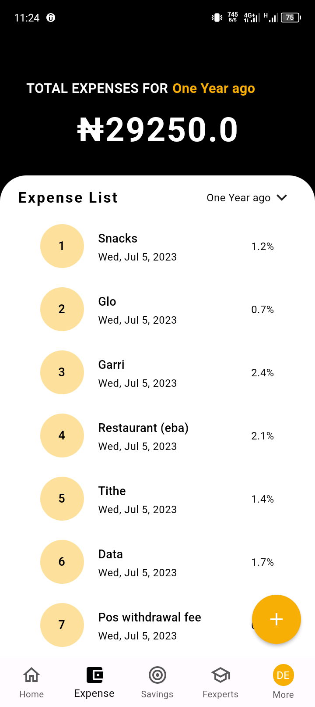
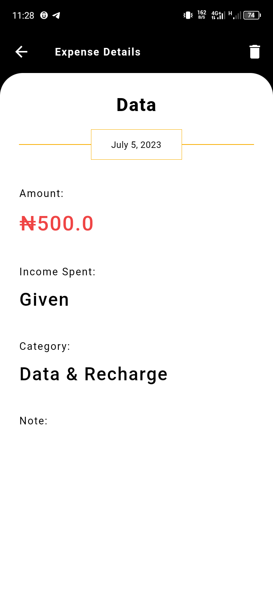
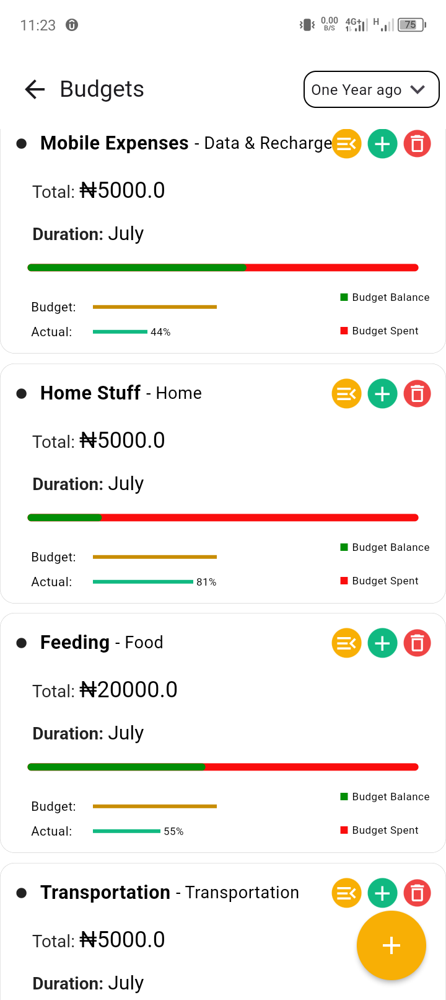

# Lifi - Your Ultimate Financial Companion

Lifi is a comprehensive personal finance management app built with Flutter and Firebase. Designed to empower users to take control of their finances and achieve their financial goals, Lifi offers an intuitive interface and powerful features catering to users of all financial backgrounds.

## Key Features

### 1. Expense Tracking

- Record and categorize daily and recurring expenses
- Gain clear insights into spending patterns

### 2. Income Tracking

  
   

- Monitor various income sources (salary, freelance, investments)
- Maintain a complete overview of financial inflows

### 3. Targeted Savings

- Set and visualize financial goals
- Track progress towards savings targets

### 4. Budgeting

- Create customized budgets for different categories
- Set spending limits with real-time notifications
- Generate reports to help stick to budgetary goals

### 5. Reports and Visualization

- Gain insights through detailed financial reports
- Visualize spending patterns and identify areas for improvement

### 6. Financial Statement Export

- Generate and export professional-looking financial statements as PDFs
- Easily share with accountants or financial advisors

### 7. Smart Purchase Planner

- Plan future purchases and receive intelligent recommendations
- Make informed buying decisions aligned with financial goals

## Tech Stack

- Frontend: Flutter
- Backend: Firebase
- Database: Cloud Firestore
- Authentication: Firebase Authentication
- Cloud Functions: Firebase Cloud Functions
- Analytics: Firebase Analytics

## Getting Started

### Prerequisites

- Flutter SDK
- Dart SDK
- Firebase account and project set up

### Installation

1. Clone the repository:
